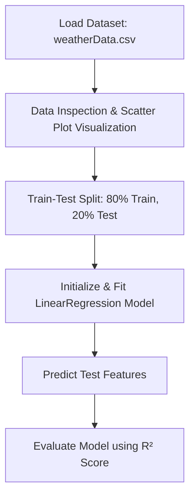

# Simple Linear Regression (Scikit-Learn Implementation) 📈

This notebook demonstrates the standard machine learning workflow for building and evaluating a **Simple Linear Regression** model using `scikit-learn`.

---

## 🚀 Workflow Pipeline

### 1. Data Processing
*   **Dataset**: `weatherData.csv` (Filtered to `Temperature (C)` and `Humidity`)
*   **Predictor Feature ($X$)**: `Humidity`
*   **Target Label ($y$)**: `Temperature (C)`
*   **Split Ratio**: 80% Training, 20% Testing (`random_state = 42`)

---

## 📊 Evaluation & Metrics

The model computes the optimal parameters to define the line of best fit:

$$\text{Temperature} = m \times \text{Humidity} + b$$

### Parameters:
*   **Slope ($m$)**: `-0.7393712` (A negative relationship indicating that higher humidity levels correlate with cooler temperatures)
*   **Intercept ($b$)**: `76.81510701630589`
*   **R² Score**: `0.896688449829141` (The model explains **~89.7%** of the variance in temperature)

---

## 📈 Sample Results

A comparison of the actual vs. predicted temperature values from the test dataset shows high accuracy:

| Humidity ($X_{test}$) | Actual Temperature ($y_{test}$) | Predicted Temperature ($\hat{y}_{pred}$) |
| :--- | :---: | :---: |
| 70.07% | 24.89 °C | 25.01 °C |
| 92.08% | 7.32 °C | 8.73 °C |
| 63.72% | 22.10 °C | 29.70 °C |
| 84.17% | 20.55 °C | 14.58 °C |
| 45.23% | 42.19 °C | 43.37 °C |
| 84.69% | 9.54 °C | 14.20 °C |
| 51.69% | 40.88 °C | 38.60 °C |

---

## 🛠️ Usage

To execute the notebook:
1. Ensure the dataset exists at `./Dataset/weatherData.csv`.
2. Install dependencies: `pip install numpy pandas matplotlib scikit-learn`.
3. Open and run `Linear Regression.ipynb`.
